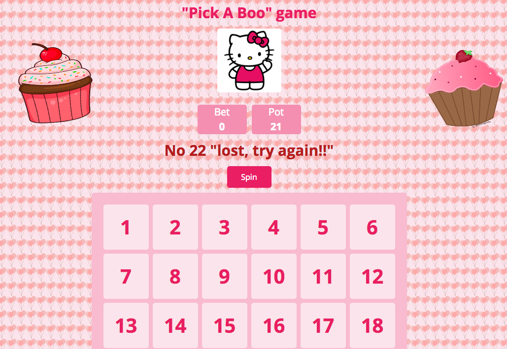

###GA WDI London - Project 1

##"Pick a Boo" game

#Inspiration:
The game is inspired from the Roulette game.

#The game: 
1.One player game created for children. The player selects several numbers from 
  the range of numbers 1-36 printed on the board.
2.Games starts with Pot of 50. Clicking on "Spin" button makes wheel spin and a 
  random number is selected as winning number.   
3.Pot counter decreases at beginning of every new game depending on how many
  numbers the player has selected (ie. if player selected 5 numbers, Pot decreases by 5).
  The winning number is displayed with a short message depending if the player has won or lost. 
4. When player wins, the Pot increases by 36. At the end of game, the Bet count  
   is reset to 0. 

#Tools:
1. HTML 5, CSS and jQuery to create this game.
2.'Open Sans' Font Google font was used to style the game. 
3. Several Animations (swing, bounce, pulse, flip) were created using the Animate.css 
   stylesheet.

#Challenges:
It was a challenge to style the game using HTML and CSS in general. I wanted to create two vertical strips of pattern to sit on the left and right side. After various attemps using a background with pattern repeat, I failed to make the code work. In the end, I opted for a background applied to the entire Body.Additionnaly, creating functions such a SetTimeout, clearBoard and resetBet with JQuery was not an easy task.  
